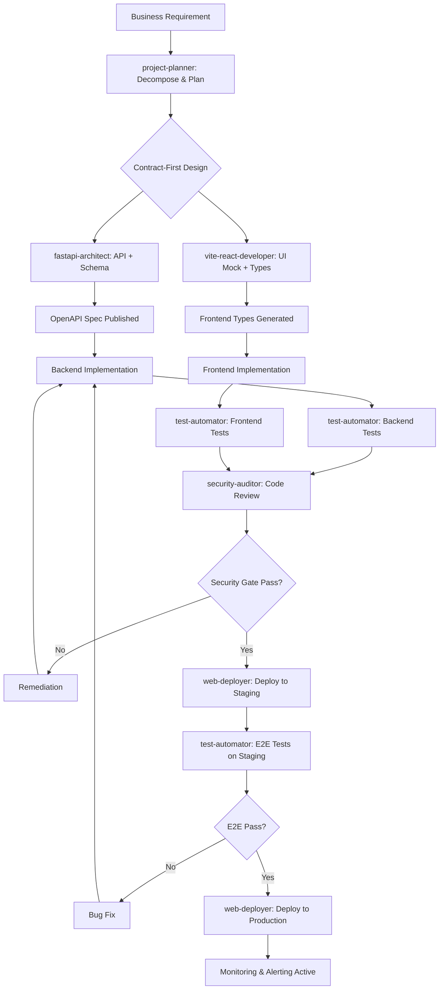

# Web Application Development Strategy

## Full-Stack FastAPI + Vite/React with Claude Code SubAgents

## Document owner yinbo-liao,email:yinbo.leon@gmail.com
---

## Table of Contents

1. [Executive Summary](#1-executive-summary)
2. [Architecture Overview](#2-architecture-overview)
3. [SubAgent Team Structure](#3-subagent-team-structure)
4. [Development Phases](#4-development-phases)
5. [Implementation Workflows](#5-implementation-workflows)
6. [Quality Assurance & Security](#6-quality-assurance--security)
7. [Deployment Strategy](#7-deployment-strategy)
8. [Operational Excellence](#8-operational-excellence)
9. [Appendix: SubAgent Reference](#9-appendix-subagent-reference)

---

## 1. Executive Summary

This strategy defines a professional-grade, AI-assisted development workflow for building modern web applications using:

- **Backend**: FastAPI (Python 3.12+) with async SQLAlchemy 2.0
- **Frontend**: Vite + React 18+ + TypeScript + Tailwind CSS
- **AI Coordination**: Claude Code with specialized SubAgents
- **Infrastructure**: Docker, Kubernetes/GitOps, Cloud-native (AWS/GCP/Azure)

### Key Objectives

| Objective | Target |
|-----------|--------|
| Time-to-MVP | 2-3 weeks with AI delegation |
| Code Coverage | >90% backend, >80% frontend |
| Security Posture | OWASP Top 10 compliant, zero critical vulnerabilities |
| Deployment Frequency | Multiple times per day with CI/CD |
| Availability | 99.9% uptime with auto-scaling |

---

## 2. Architecture Overview

### 2.1 System Architecture Diagram

```
┌─────────────────────────────────────────────────────────────────┐
│                         CLIENT LAYER                             │
│  ┌─────────────┐  ┌─────────────┐  ┌─────────────────────────┐  │
│  │   Web App   │  │  Mobile App │  │      Admin Panel        │  │
│  │  (Vite/React)│  │   (Future)  │  │     (React/Vite)        │  │
│  └──────┬──────┘  └──────┬──────┘  └───────────┬─────────────┘  │
│         │                  │                       │                │
│         └──────────────────┼───────────────────────┘                │
│                            │                                      │
└────────────────────────────┼──────────────────────────────────────┘
                             │ HTTPS / HTTP2
                             ▼
┌─────────────────────────────────────────────────────────────────┐
│                      EDGE / CDN LAYER                            │
│  ┌─────────────────────────────────────────────────────────┐   │
│  │  CloudFront / Cloud CDN / Azure CDN                      │   │
│  │  - Static asset caching (JS, CSS, images)               │   │
│  │  - DDoS protection, WAF rules                           │   │
│  │  - Geo-routing, edge compression                        │   │
│  └─────────────────────────────────────────────────────────┘   │
└─────────────────────────────────────────────────────────────────┘
                             │
                             ▼
┌─────────────────────────────────────────────────────────────────┐
│                    LOAD BALANCER / REVERSE PROXY                   │
│  ┌─────────────────────────────────────────────────────────┐   │
│  │  AWS ALB / Nginx / Traefik / Azure Application Gateway   │   │
│  │  - SSL termination (Let's Encrypt / ACM)                  │   │
│  │  - Rate limiting, request routing                         │   │
│  │  - Health checks, sticky sessions                       │   │
│  └─────────────────────────────────────────────────────────┘   │
└─────────────────────────────────────────────────────────────────┘
                             │
              ┌──────────────┼──────────────┐
              │              │              │
              ▼              ▼              ▼
┌─────────────────┐ ┌─────────────┐ ┌─────────────────┐
│   API GATEWAY    │ │   STATIC    │ │  WEBSOCKET      │
│   (Kong/AWS API  │ │   SERVER    │ │  HANDLER        │
│    Gateway)      │ │  (Nginx)    │ │  (FastAPI WS)   │
│                  │ │             │ │                 │
│  Auth, Rate      │ │  React SPA  │ │  Real-time      │
│  Limit, Routing  │ │  (Built by  │ │  notifications  │
│                  │ │  Vite)      │ │                 │
└────────┬────────┘ └─────────────┘ └─────────────────┘
         │
         ▼
┌─────────────────────────────────────────────────────────────────┐
│                     APPLICATION LAYER                            │
│  ┌─────────────────────────────────────────────────────────┐   │
│  │  FastAPI (Uvicorn/Gunicorn) - Containerized              │   │
│  │  ┌─────────┐ ┌─────────┐ ┌─────────┐ ┌─────────┐       │   │
│  │  │  Auth   │ │  Core   │ │  Admin  │ │  Public │       │   │
│  │  │ Module  │ │ Business│ │  APIs   │ │  APIs   │       │   │
│  │  └────┬────┘ └────┬────┘ └────┬────┘ └────┬────┘       │   │
│  │       └─────────────┴───────────┴───────────┘            │   │
│  │              Dependency Injection Container                │   │
│  │  ┌─────────┐ ┌─────────┐ ┌─────────┐ ┌─────────┐         │   │
│  │  │Services │ │ Repos   │ │ Models  │ │ Schemas │         │   │
│  │  └─────────┘ └─────────┘ └─────────┘ └─────────┘         │   │
│  └─────────────────────────────────────────────────────────┘   │
└─────────────────────────────────────────────────────────────────┘
                             │
              ┌──────────────┼──────────────┐
              │              │              │
              ▼              ▼              ▼
┌─────────────────┐ ┌─────────────┐ ┌─────────────────┐
│   DATA LAYER     │ │   CACHE     │ │   QUEUE /       │
│                  │ │   LAYER     │ │   BACKGROUND    │
│  PostgreSQL      │ │  Redis      │ │   Celery +      │
│  (RDS/Cloud SQL) │ │  (ElastiCache│ │   Redis         │
│  - Primary       │ │  /Memorystore)│ │                 │
│  - Read Replicas │ │  - Sessions   │ │  - Email        │
│  - Automated     │ │  - API Cache  │ │  - Reports      │
│    Backups       │ │  - Rate Limit │ │  - Data Processing│
└─────────────────┘ └─────────────┘ └─────────────────┘
```

### 2.2 Technology Stack

| Layer | Technology | Purpose |
|-------|-----------|---------|
| **Frontend Framework** | React 18 + TypeScript 5 | UI components, state management |
| **Build Tool** | Vite 5 | Fast dev server, optimized production builds |
| **Styling** | Tailwind CSS 3 | Utility-first responsive design |
| **State Management** | Zustand + TanStack Query | Client state + Server state |
| **Forms** | React Hook Form + Zod | Type-safe form handling |
| **Routing** | TanStack Router | Type-safe file-based routing |
| **Backend Framework** | FastAPI 0.110+ | Async API framework |
| **ORM** | SQLAlchemy 2.0 (async) | Database abstraction |
| **Migrations** | Alembic | Schema versioning |
| **Validation** | Pydantic v2 | Request/response schemas |
| **Auth** | OAuth2 + JWT (python-jose) | Authentication/authorization |
| **Task Queue** | Celery + Redis | Background processing |
| **Container** | Docker + Docker Compose | Development parity |
| **Orchestration** | Kubernetes / ECS / Cloud Run | Production deployment |
| **IaC** | Terraform | Infrastructure provisioning |
| **CI/CD** | GitHub Actions | Automated pipelines |
| **Monitoring** | Prometheus + Grafana | Metrics and dashboards |
| **Logging** | Loki / ELK | Centralized log aggregation |
| **Tracing** | OpenTelemetry + Jaeger | Distributed tracing |

---

## 3. SubAgent Team Structure

### 3.1 Agent Hierarchy

```
┌─────────────────────────────────────────┐
│         project-planner (Opus)          │
│    Principal Engineer / Tech Lead       │
│  - Architecture decisions               │
│  - Task decomposition                   │
│  - Risk management                      │
│  - Cross-team coordination              │
└────────────┬────────────────────────────┘
             │ Delegates to specialists
    ┌────────┼────────┬─────────┐
    ▼        ▼        ▼         ▼
┌────────┐ ┌────────┐ ┌────────┐ ┌────────┐
│fastapi-│ │vite-   │ │security│ │test-   │
│architect│ │react-  │ │auditor │ │automator│
│(Opus)   │ │developer│ │(Opus) │ │(Sonnet) │
│         │ │(Sonnet) │ │       │ │         │
│Backend  │ │Frontend │ │Security│ │QA /    │
│design   │ │UI/UX    │ │review │ │Testing │
└────┬───┘ └────┬───┘ └───┬───┘ └───┬────┘
     │          │         │         │
     └──────────┴─────────┴─────────┘
                         │
                         ▼
              ┌─────────────────────┐
              │   web-deployer      │
              │     (Opus)          │
              │  DevOps / SRE       │
              │  - CI/CD pipelines  │
              │  - Infrastructure   │
              │  - Monitoring       │
              └─────────────────────┘
```

### 3.2 Agent Responsibilities Matrix

| Concern | Primary Agent | Supporting Agents |
|---------|-------------|-------------------|
| **API Design** | fastapi-architect | project-planner (contract approval) |
| **Database Schema** | fastapi-architect | test-automator (test data factories) |
| **UI Components** | vite-react-developer | project-planner (design system alignment) |
| **API Integration** | vite-react-developer | fastapi-architect (OpenAPI spec) |
| **Authentication Flow** | fastapi-architect | security-auditor (threat model), vite-react-developer (UI) |
| **Authorization (RBAC)** | security-auditor | fastapi-architect (implementation) |
| **Input Validation** | fastapi-architect | security-auditor (bypass testing) |
| **XSS Prevention** | vite-react-developer | security-auditor (DOM testing) |
| **Dependency Updates** | security-auditor | web-deployer (CI scanning) |
| **Unit Tests** | test-automator | fastapi-architect / vite-react-developer |
| **Integration Tests** | test-automator | fastapi-architect (test endpoints) |
| **E2E Tests** | test-automator | web-deployer (staging environment) |
| **Load Tests** | web-deployer | test-automator (performance benchmarks) |
| **Docker Images** | web-deployer | security-auditor (image scanning) |
| **CI/CD Pipeline** | web-deployer | test-automator (test stage), security-auditor (scan stage) |
| **Infrastructure** | web-deployer | project-planner (cost/scope) |
| **Monitoring Setup** | web-deployer | fastapi-architect (metrics endpoints) |
| **Incident Response** | web-deployer | security-auditor (forensics) |

---

## 4. Development Phases

### 4.1 Phase 0: Foundation (Week 1)

**Goal**: Project scaffolding, tooling, and team agreements

| Task | Owner | Deliverable |
|------|-------|-------------|
| Repository setup (monorepo vs polyrepo) | project-planner | Git repo structure |
| Development environment (Docker Compose) | web-deployer | `docker-compose.yml` |
| CI/CD skeleton | web-deployer | `.github/workflows/ci.yml` |
| Linting & formatting config | fastapi-architect / vite-react-developer | `ruff`, `eslint`, `prettier` configs |
| Pre-commit hooks | web-deployer | `.pre-commit-config.yaml` |
| Branching strategy | project-planner | `CONTRIBUTING.md` |
| Design system foundation | vite-react-developer | Tailwind config, base components |
| Database setup | fastapi-architect | SQLAlchemy base, first migration |
| API contract template | project-planner | `API_CONTRACT.yaml` template |

**Claude Code Invocation**:
```bash
> "Use project-planner to set up repository structure and development standards"
> "Use web-deployer to create Docker Compose development environment"
> "Use fastapi-architect to initialize FastAPI project with SQLAlchemy"
> "Use vite-react-developer to scaffold Vite + React + Tailwind project"
```

### 4.2 Phase 1: Core Features (Weeks 2-3)

**Goal**: MVP with authentication, core CRUD, and basic UI

**Backend Stream**:
```
project-planner → fastapi-architect: "Design user authentication system"
fastapi-architect → test-automator: "Write tests for auth endpoints"
fastapi-architect → security-auditor: "Review auth implementation"
```

**Frontend Stream**:
```
project-planner → vite-react-developer: "Build login/register UI with form validation"
vite-react-developer → test-automator: "Write component tests for auth forms"
```

**Integration Point**:
```
fastapi-architect ↔ vite-react-developer: Sync on OpenAPI spec for auth API
```

### 4.3 Phase 2: Feature Expansion (Weeks 4-6)

**Goal**: Business logic implementation with full test coverage

**Workflow Pattern**:
1. `project-planner` decomposes feature into tasks
2. `fastapi-architect` implements backend (API + DB + tests)
3. `vite-react-developer` implements frontend (components + API integration + tests)
4. `test-automator` verifies integration and writes E2E tests
5. `security-auditor` reviews for vulnerabilities
6. `web-deployer` updates CI/CD and deploys to staging

### 4.4 Phase 3: Hardening & Launch (Weeks 7-8)

**Goal**: Production readiness

| Activity | Agents Involved |
|----------|-----------------|
| Security audit (penetration test) | security-auditor (lead), all others |
| Performance optimization | web-deployer (infra), fastapi-architect (queries) |
| Load testing | web-deployer, test-automator |
| Documentation | project-planner (architecture), web-deployer (operations) |
| Production deployment | web-deployer (lead) |
| Monitoring & alerting setup | web-deployer |

---

## 5. Implementation Workflows

### 5.1 Feature Development Workflow



### 5.2 Daily Development Rhythm

**Morning Standup (AI-assisted)**:
```bash
> "Summarize yesterday's progress across all agents"
> "Identify blockers and dependencies for today"
> "Update task priorities based on security-auditor findings"
```

**Development Session**:
```bash
# 1. Start with plan mode for complex changes
claude --permission-mode plan

# 2. Delegate to appropriate agent
> "Use fastapi-architect to implement the order processing API"

# 3. Parallel frontend work
> "Use vite-react-developer to build the order dashboard UI"

# 4. Continuous testing
> "Use test-automator to run the full test suite"

# 5. Security check before commit
> "Use security-auditor to scan changed files"
```

### 5.3 Code Review Protocol

**Automated Review (CI Pipeline)**:
1. Linting (Ruff, ESLint, Prettier)
2. Type checking (mypy, tsc)
3. Unit tests (pytest, vitest)
4. Security scan (Bandit, npm audit, Trivy)
5. Coverage check (codecov)

**AI Review (Claude Code)**:
```bash
> "Use security-auditor to review PR #42 for injection vulnerabilities"
> "Use fastapi-architect to review database query patterns in PR #42"
> "Use vite-react-developer to review React component performance in PR #42"
```

---

## 6. Quality Assurance & Security

### 6.1 Testing Pyramid

```
                    ┌─────────────┐
                    │   E2E Tests │  ← Playwright, 5-10% coverage
                    │  (Critical  │     Critical user journeys
                    │   Flows)    │
                    ├─────────────┤
                    │ Integration │  ← API + DB tests, 20-30% coverage
                    │   Tests     │     Feature-level validation
                    ├─────────────┤
                    │   Unit Tests│  ← pytest/vitest, 60-70% coverage
                    │  (Business  │     Functions, hooks, utilities
                    │   Logic)    │
                    └─────────────┘
```

### 6.2 Security Gates

| Gate | Trigger | Owner | Action on Failure |
|------|---------|-------|-------------------|
| **SAST** | Every commit | security-auditor | Block merge, create ticket |
| **Dependency Scan** | Every PR | security-auditor | Auto-update if patch available |
| **Container Scan** | Every build | web-deployer | Fail CI, rebuild base image |
| **Penetration Test** | Pre-release | security-auditor | Hold release, fix critical |
| **Code Review** | Every PR | All agents | Require 2 approvals |

### 6.3 Security Checklist per Feature

- [ ] Input validation on all endpoints (Pydantic + custom validators)
- [ ] Output serialization (no raw ORM objects exposed)
- [ ] Authentication required (except public endpoints)
- [ ] Authorization checks (RBAC decorators)
- [ ] Rate limiting configured (slowapi / Redis)
- [ ] SQL injection prevention (parameterized queries only)
- [ ] XSS prevention (React auto-escape + DOMPurify for rich text)
- [ ] CSRF protection (SameSite cookies + custom headers)
- [ ] Secret management (no hardcoded keys, env vars only)
- [ ] Logging (no sensitive data in logs, structured format)

---

## 7. Deployment Strategy

### 7.1 Environment Progression

```
┌─────────────┐     ┌─────────────┐     ┌─────────────┐     ┌─────────────┐
│   LOCAL     │ --> │     CI      │ --> │  STAGING    │ --> │ PRODUCTION  │
│             │     │             │     │             │     │             │
│ Developer   │     │ Automated   │     │ Pre-prod    │     │ Live        │
│ Workstation │     │ Tests       │     │ Validation  │     │ Traffic     │
│             │     │             │     │             │     │             │
│ docker-compose│   │ GitHub Actions│  │ Terraform   │     │ Terraform   │
│ up          │     │ workflow    │     │ apply       │     │ apply       │
└─────────────┘     └─────────────┘     └─────────────┘     └─────────────┘
     │                    │                   │                   │
     ▼                    ▼                   ▼                   ▼
  Hot reload          Parallel tests      Blue-green deploy   Canary deploy
  Seeded data         Coverage gates      Smoke tests        Gradual traffic
  Local DB            Security scans      Integration tests   Rollback ready
```

### 7.2 Deployment Patterns

**Blue-Green Deployment** (Zero Downtime):
```bash
# web-deployer manages this via Terraform/K8s
1. Deploy new version to "green" environment
2. Run smoke tests against green
3. Switch load balancer from "blue" to "green"
4. Keep blue running for instant rollback
5. Terminate blue after stability confirmed
```

**Canary Deployment** (Risk Mitigation):
```bash
# Gradual traffic shift
1. Deploy to 5% of production pods
2. Monitor error rates, latency, business metrics
3. Increase to 25%, 50%, 100% if healthy
4. Automatic rollback if error rate > threshold
```

### 7.3 Rollback Procedures

| Scenario | Rollback Method | Time to Recover |
|----------|----------------|-----------------|
| Bad deployment | Switch load balancer to previous version | < 30 seconds |
| Database issue | Alembic downgrade + restore from snapshot | < 5 minutes |
| Security breach | Isolate containers, rotate secrets, redeploy | < 10 minutes |
| Data corruption | Point-in-time restore + replay valid transactions | < 1 hour |

---

## 8. Operational Excellence

### 8.1 Monitoring Stack

| Layer | Tool | Metrics |
|-------|------|---------|
| **Infrastructure** | Prometheus + Grafana | CPU, memory, disk, network |
| **Application** | Prometheus + custom metrics | Request rate, latency, errors, saturation |
| **Business** | Custom dashboards | Sign-ups, conversions, revenue |
| **Logs** | Loki / ELK | Structured JSON, correlation IDs |
| **Traces** | Jaeger / Tempo | Request flow across services |
| **Uptime** | Pingdom / UptimeRobot | Synthetic checks, SLA monitoring |
| **Alerts** | PagerDuty / Opsgenie | On-call rotation, escalation |

### 8.2 Alerting Rules

```yaml
# Critical (Page immediately)
- name: API Error Rate High
  expr: rate(http_requests_total{status=~"5.."}[5m]) > 0.05
  for: 2m

- name: Database Connection Pool Exhausted
  expr: sqlalchemy_pool_available < 5
  for: 1m

# Warning (Slack notification)
- name: High CPU Usage
  expr: cpu_usage_percent > 80
  for: 10m

- name: Slow API Response
  expr: histogram_quantile(0.95, rate(http_request_duration_seconds_bucket[5m])) > 1
  for: 5m
```

### 8.3 Incident Response Runbook

**SEV 1 (Site Down)**:
1. Acknowledge alert within 5 minutes
2. Assess scope (all users vs region vs feature)
3. If deployment-related, execute blue-green rollback
4. If database-related, initiate point-in-time restore
5. Communicate status via status page
6. Post-incident review within 24 hours

**SEV 2 (Degraded Performance)**:
1. Identify bottleneck (DB query, external API, memory leak)
2. Scale horizontally if resource-constrained
3. Enable circuit breakers for failing dependencies
4. Monitor for 30 minutes after mitigation

---

## 9. Appendix: SubAgent Reference

### 9.1 Agent File Locations

```
~/.claude/agents/your-project/
├── project-planner.md      # Technical planning & coordination
├── fastapi-architect.md    # Backend architecture & implementation
├── vite-react-developer.md # Frontend development & UI/UX
├── security-auditor.md     # Security review & penetration testing
├── test-automator.md       # Testing strategy & automation
└── web-deployer.md         # CI/CD, infrastructure & DevOps
```

### 9.2 Quick Reference Commands

**Planning**:
```bash
> "Use project-planner to create technical spec for [feature]"
> "Use project-planner to estimate effort and identify risks"
```

**Backend Development**:
```bash
> "Use fastapi-architect to design API for [resource]"
> "Use fastapi-architect to implement [feature] with full test coverage"
> "Use fastapi-architect to optimize [query] for N+1 problem"
```

**Frontend Development**:
```bash
> "Use vite-react-developer to build [component] with loading/error states"
> "Use vite-react-developer to integrate [API] with TanStack Query"
> "Use vite-react-developer to implement responsive [page]"
```

**Security**:
```bash
> "Use security-auditor to review [file/PR] for OWASP compliance"
> "Use security-auditor to perform penetration test on auth flow"
> "Use security-auditor to scan dependencies for vulnerabilities"
```

**Testing**:
```bash
> "Use test-automator to write unit tests for [module]"
> "Use test-automator to set up E2E tests for [user journey]"
> "Use test-automator to improve coverage in [area]"
```

**Deployment**:
```bash
> "Use web-deployer to containerize application with Docker"
> "Use web-deployer to set up GitHub Actions CI/CD pipeline"
> "Use web-deployer to deploy to [environment] with monitoring"
> "Use web-deployer to configure auto-scaling and load balancing"
```

### 9.3 Model Assignment Rationale

| Agent | Model | Justification |
|-------|-------|---------------|
| project-planner | Opus | Complex system thinking, risk analysis, cross-domain coordination |
| fastapi-architect | Opus | Database design, security patterns, async architecture |
| vite-react-developer | Sonnet | Standard implementation, fast iteration, strong coding |
| security-auditor | Opus | Threat modeling, vulnerability analysis, compliance mapping |
| test-automator | Sonnet | Pattern implementation, comprehensive coverage |
| web-deployer | Opus | Infrastructure design, multi-service orchestration, incident response |

### 9.4 Integration Checklist

Before starting development:
- [ ] All 6 agent files installed in `~/.claude/agents/your-project/`
- [ ] Repository initialized with proper structure
- [ ] Docker Compose development environment working
- [ ] CI/CD skeleton passing basic checks
- [ ] OpenAPI spec template created
- [ ] Design system foundation (colors, typography, spacing)
- [ ] Database migration baseline established
- [ ] Pre-commit hooks configured
- [ ] Team conventions documented (branching, commit messages, PR template)

---

## Document Information

| Property | Value |
|----------|-------|
| **Version** | 1.0 |
| **Last Updated** | 2026-05-10 |
| **Author** | Claude Code SubAgent Team |
| **Review Cycle** | Monthly or per major release |
| **Status** | Active |

---

*This strategy document is a living document. Update it as the team learns, tools evolve, and requirements change. Coordinate updates through project-planner agent.*
